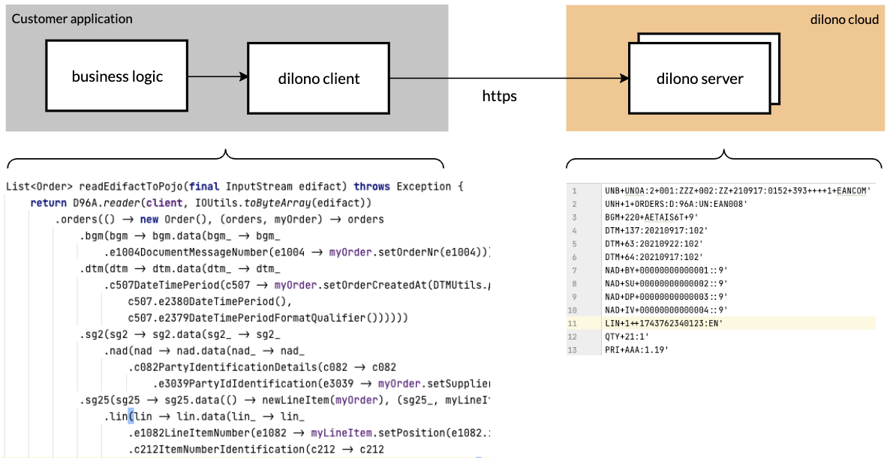

= Dilono - Java DSL for UN/EDIFACT
:toc: left

== Before start

Dilono's primary goals are:

. Consume and produce EDIFACT messages with Java, in absolutely XML-free way.
. Be a lightweight library with few dependencies so that any application can embed it.
. Best development experience by enabling comprehensive autocompletion for segments, components, fields, etc.
. Take care of a range of non-functional features like segment counting, numbers formatting, etc.

What does Dilono NOT suppose to:

. Support other formats than EDIFACT.
. Do any kind of communication protocols like AS2, SFTP, etc.
. Implement Enterprise Integration Patterns EIP like routing, spilling, streaming, etc.

== Getting started

=== Prerequisites

. Java JDK 8+
. A valid access token.
Can be requested https://dilono.com/[here].
. Maven, Gradle or anything else to manage dependencies.
. Dilono uses `slf4j-api` for logging. Any implementation of it has to be defined as a dependency to the application.

=== Declare maven dependencies

.Added repository credentials to settings.xml:
[source,xml]
----
<servers>
    <server>
        <id>dilono-maven-public</id>
        <username>${dilono.maven.user.name}</username>
        <password>${dilono.maven.user.password}</password>
    </server>
</servers>
----

.pom.xml - define repositories
[source,xml]
----
include::../../../../pom.xml[tags=maven-repositories]
----

.pom.xml - declare dependencies
[source,xml]
----
include::../../../pom.xml[tags=maven-dependencies]
----

=== Configure Dilono client

.Application.java
[source%nowrap,java]
----
include::../../main/java/com/dilono/sample/basic/Application.java[tags=esc-client-bean-config]
----

NOTE: Spring annotations are used in this example, but they don't have to be used.
Dilono does not depend on any frameworks.

=== Consuming EDIFACT

[source%nowrap,java]
----
include::../../main/java/com/dilono/sample/basic/EdifactOrdersReader.java[]
----

=== Producing EDIFACT

[source%nowrap,java]
----
include::../../main/java/com/dilono/sample/basic/EdifactInvoicWriter.java[]
----

== How does Dilono work?

=== High-Level Overview

Dilono is client-server model application.
The server takes care of actual EDIFACT processing and supplies a model to the client.
The client operates on that model like on an object graph.
For instance, it reads certain segments and may ignore the rest if it's not needed.
In case of write operation, the client populates the model and sends to the server to convert to EDIFACT.

=== Consuming EDIFACT

Dilono declares operations in functional way through lambdas - consumers, suppliers, functions.
Lambdas get evaluated under certain conditions.
Let's consider an example how Dilono converts a D96A ORDERS message to a POJO:
[source%nowrap,java]

----
include::../../test/java/com/dilono/sample/basic/EdifactOrdersReaderTest.java[tags=howto-read-edifact-1]
----

<1> We start with the factory method `.orders()` whereas `() -> new Order()` a factory for POJOs being mapped to and `(orders, myOrder) -> ...` is the actual mapping function with two arguments.
An interchange may contain more than one message and the factory will create a new pojo for each message.
The first argument `orders` is a `Reader` of the actual EDIFACT message and the second one `myOrder` is a new instance of POJO created by the factory `() -> new Order()`.
<2> The `.bgm()` method accepts a consumer `bgm` of type `BGMBeginningOfMessageQuery` to query BGM segments of the message.
<3> The `bgm` query has a method `.data()` that accepts a consumer `bgm_` of type `BGMBeginningOfMessageStdReader`.
<4> The reader provides all methods, according to the subset specification, to read the data from the segment, its components and fields.
So the `e1004 -> myOrder.setOrderNr(e1004)` consumer sets the order number to the `myOrder` POJO.

Now, let's query NAD segments for buyer's number conditionally:
[source%nowrap,java]

----
include::../../test/java/com/dilono/sample/basic/EdifactOrdersReaderTest.java[tags=howto-read-edifact-2]
----

<1> We query the Segment Group 2 of the ORDERS message by calling `.sg2()` on the `orders`.
<2> The `sg2` query has a method `.must()` that accepts a consumer `sg2_` of type `SegmentGroup2Condition`.
<3> The `sg2` query also provides access to all nested conditions, in this case `NADNameAndAddressCondition`.
<4> So we traverse until the field `e3035PartyQualifier` and eventually build a predicate for the `sg2.data()` method.
<5> If `.must()` is evaluated to `true`, only then the `sg2.data()` consumer will be evaluated.
Otherwise, an exception is thrown.
<6> Declaration of `.can()` and `.must()` predicates is exactly the same.
However, the result is different - the `.can()` doesn't throw, and it makes `.data()` optional.

Now, let's loop over Segment Group 25 and map all line items:
[source%nowrap,java]

----
include::../../test/java/com/dilono/sample/basic/EdifactOrdersReaderTest.java[tags=howto-read-edifact-3]
----

<1> The Segment Group 25 may occur many times and each time it there must be a new POJO that represents a line item.
Because of this, the `.data()` is a consumer of two arguments.
The first `() -> newLineItem(myOrder)` is a factory for POJO and the second `(sg25_, myLineItem) -> ...` is the actual mapping function with two arguments - from and to.
<2> The `.lin()` query is evaluated for each LIN segment for each segment group.
<3> The value of the `e7140` field is set to POJO as `sku` field.

Note that all names of methods, variables, etc. correspond to the EDIFACT specification.
This significantly increases readability of the code.

The source code for this example is available on https://github.com/dilono/dilono-samples[GitHub].

=== Producing EDIFACT

Dilono produces EDIFACT in similar to consuming, functional way.
Let's consider an example how Dilono converts a POJO to D96A INVOIC message:
[source%nowrap,java]

----
include::../../test/java/com/dilono/sample/basic/EdifactInvoicWriterTest.java[tags=howto-write-edifact-1]
----

<1> Define default interchange delimiters.
<2> Then the interchange header - sender, recipient, their code qualifiers, etc.
<3> An interchange may contain more than one message.
Therefore, the `.invoic()` method has two arguments.
The first one `() -> invoices.stream()` is the source or from producer, and the second `(invoice, invoic) -> ...` is actual mapping function.
Dilono will create exactuly the same number of INVOIC message as the size of the `invoices` list.
<4> The `.unh()` method defined the header of the message.
<5> The `.bgm()` method accepts a consumer `bgm` of type `BGMBeginningOfMessageWrite` to write data to the BGM segment has a method `.data()` that accepts a consumer `bgm_` of type `BGMBeginningOfMessageStdWriter`.
<6> The writer provides all methods, according to the subset specification, to write the data the segment, its components and fields.
The returned value of `invoice.getInvoiceNr()` method will be set to `e1004` field.

The example above produces the following:
[source%nowrap,text]

----
include::../../test/resources/fixtures/EdifactInvoicWriterTest/snippet1.edi[]
----

Now, let's add information about delivery party and invoicee.
For that, `.sg2()` has to be repeated two times

[source%nowrap,java]
----
include::../../test/java/com/dilono/sample/basic/EdifactInvoicWriterTest.java[tags=howto-write-edifact-2]
----

<1> The fist write operation `.sg2()` declares delivery party and its GLN.
<2> The second write operation `.sg2()` declares invoicee and its GLN.
<3> Additionally, the VAT ID for invoicee has to be provided.
So, a nested `.sg3()` is declared.

The example above produces the following:
[source%nowrap,text]

----
include::../../test/resources/fixtures/EdifactInvoicWriterTest/snippet2.edi[]
----

Let's move on and add line items.

[source%nowrap,java]
----
include::../../test/java/com/dilono/sample/basic/EdifactInvoicWriterTest.java[tags=howto-write-edifact-3]
----

<1> The line items are declared in the `.sg25()`.
The `() -> invoice.getLineItems().stream()` producer will create exact amount of Segment Group 25 as the `invoice.getLineItems()` list has.
The mapping function `(lineItem, sg25) -> ...` maps the POJO to the segment.

The example above produces the following:
[source%nowrap,text]

----
include::../../test/resources/fixtures/EdifactInvoicWriterTest/snippet3.edi[]
----

The source code for this example is available on https://github.com/dilono/dilono-samples[GitHub].

== Supported subsets

. Currently supported subsets and their message types
[source%nowrap,json]
----
{
    "d01b": [ "DELFOR", "DESADV", "IFTMIN", "INVOIC", "INVRPT", "ORDERS", "ORDRSP", "PRICAT", "SLSRPT" ],
    "d04a": [ "DELFOR", "DESADV", "IFTMIN", "INVOIC", "INVRPT", "ORDERS", "ORDRSP", "PRICAT", "SLSRPT" ],
    "d07a": [ "DELFOR", "DESADV", "IFTMIN", "INVOIC", "INVRPT", "ORDERS", "ORDRSP", "PRICAT", "SLSRPT" ],
    "d96a": [ "DELFOR", "DESADV", "IFTMIN", "INVOIC", "INVRPT", "ORDERS", "ORDRSP", "PRICAT", "SLSRPT" ],
    "d96b": [ "DELFOR", "DESADV", "IFTMIN", "INVOIC", "INVRPT", "ORDERS", "ORDRSP", "PRICAT", "SLSRPT" ],
    "d99a": [ "DELFOR", "DESADV", "IFTMIN", "INVOIC", "INVRPT", "ORDERS", "ORDRSP", "PRICAT", "SLSRPT" ]
}
----

NOTE: Support for a subset or a message can be added by http://dilono.com[request].

== Integration scenarios

Checkout our https://github.com/dilono/dilono-samples[repository on GitHub] with various integration scenarios.
